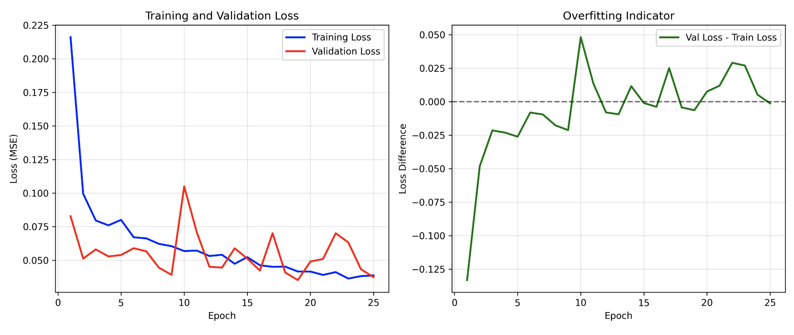

# Results & Ideas


## Ideas
- pretrained models for face recognition tasks: https://github.com/serengil/deepface 


## evaluation on my dataset 

pretrained resnet18, finetuned on scut for 30 epochs with the following params, also without extracting images first: 
```python
FC_DIM_SIZE = 1024
DROPOUT_PROB = 0.5
OUTFEATURES = 1
LR = 4e-5
EPOCHS = 30
BATCH_SIZE = 32

```

| #  | Image                         | Predicted Score |
|----|------------------------------|-----------------|
| 1  | res/test/photo_1.jpg         | 6.065 / 10      |
| 2  | res/test/photo_2.jpg         | 5.284 / 10      |
| 3  | res/test/photo_3.jpg         | 5.834 / 10      |
| 4  | res/test/photo_4.jpg         | 6.138 / 10      |
| 5  | res/test/photo_5.jpg         | 5.682 / 10      |
| 6  | res/test/photo_6.jpg         | 6.539 / 10      |
| 7  | res/test/photo_7.jpg         | 5.658 / 10      |
| 8  | res/test/photo_8.jpg         | 5.070 / 10      |
| 9  | res/test/photo_9.jpg         | 6.612 / 10      |
| 10 | res/test/photo_10.jpg        | 7.345 / 10      |
| 11 | res/test/photo_11.jpg        | 5.842 / 10      |
| 12 | res/test/photo_12.jpg        | 5.643 / 10      |
| 13 | res/test/photo_13.jpg        | 7.636 / 10      |
| 14 | res/test/photo_14.jpg        | 5.811 / 10      |
| 15 | res/test/photo_15.jpg        | 6.297 / 10      |
| 16 | res/test/photo_16.jpg        | 6.023 / 10      |
| 17 | res/test/photo_17.jpg        | 6.588 / 10      |
| 18 | res/test/photo_18.jpg        | 6.202 / 10      |
| 19 | res/test/photo_19.jpg        | 6.348 / 10      |
| 20 | res/test/photo_20.jpg        | 7.473 / 10      |
| 21 | res/test/photo_21.jpg        | 6.379 / 10      |
| 22 | res/test/photo_22.jpg        | 5.610 / 10      |
| 23 | res/test/photo_23.jpg        | 6.282 / 10      |
| 24 | res/test/photo_24.jpg        | 6.029 / 10      |
| 25 | res/test/photo_25.jpg        | 7.083 / 10      |
| 26 | res/test/photo_26.jpg        | 6.977 / 10      |
| 27 | res/test/photo_27.jpg        | 7.307 / 10      |
| 28 | res/test/photo_28.jpg        | 6.766 / 10      |
| 29 | res/test/photo_29.jpg        | 5.354 / 10      |
| 30 | res/test/photo_30.jpg        | 5.483 / 10      |
| 31 | res/test/photo_31.jpg        | 5.221 / 10      |
| 32 | res/test/photo_32.jpg        | 4.990 / 10      |
| 33 | res/test/photo_33.jpg        | 6.312 / 10      |
| 34 | res/test/photo_34.jpg        | 6.643 / 10      |


Here's the cropped face detection results formatted in the same table style:

## Face-Cropped Results

| #  | Image                         | Predicted Score | Notes |
|----|------------------------------|-----------------|-------|
| 1  | res/test/photo_1.jpg         | 5.690 / 10      |       |
| 2  | res/test/photo_2.jpg         | 5.728 / 10      |       |
| 3  | res/test/photo_3.jpg         | 4.935 / 10      |       |
| 4  | res/test/photo_4.jpg         | 6.209 / 10      |       |
| 5  | res/test/photo_5.jpg         | 5.316 / 10      |       |
| 6  | res/test/photo_6.jpg         | No face detected | Skipped |
| 7  | res/test/photo_7.jpg         | 5.339 / 10      |       |
| 8  | res/test/photo_8.jpg         | 5.539 / 10      |       |
| 9  | res/test/photo_9.jpg         | 6.941 / 10      |       |
| 10 | res/test/photo_10.jpg        | 7.588 / 10      |       |
| 11 | res/test/photo_11.jpg        | 7.011 / 10      |       |
| 12 | res/test/photo_12.jpg        | 6.818 / 10      |       |
| 13 | res/test/photo_13.jpg        | 7.213 / 10      |       |
| 14 | res/test/photo_14.jpg        | 5.494 / 10      |       |
| 15 | res/test/photo_15.jpg        | 5.863 / 10      |       |
| 16 | res/test/photo_16.jpg        | 5.933 / 10      |       |
| 17 | res/test/photo_17.jpg        | 5.178 / 10      |       |
| 18 | res/test/photo_18.jpg        | 5.692 / 10      |       |
| 19 | res/test/photo_19.jpg        | 6.800 / 10      |       |
| 20 | res/test/photo_20.jpg        | 7.647 / 10      |       |
| 21 | res/test/photo_21.jpg        | 7.076 / 10      |       |
| 22 | res/test/photo_22.jpg        | 4.681 / 10      |       |
| 23 | res/test/photo_23.jpg        | 4.836 / 10      |       |
| 24 | res/test/photo_24.jpg        | 6.280 / 10      |       |
| 25 | res/test/photo_25.jpg        | 6.941 / 10      |       |
| 26 | res/test/photo_26.jpg        | 6.921 / 10      |       |
| 27 | res/test/photo_27.jpg        | 6.348 / 10      |       |
| 28 | res/test/photo_28.jpg        | 7.110 / 10      |       |
| 29 | res/test/photo_29.jpg        | No face detected | Skipped |
| 30 | res/test/photo_30.jpg        | 5.735 / 10      |       |
| 31 | res/test/photo_31.jpg        | 5.964 / 10      |       |
| 32 | res/test/photo_32.jpg        | 4.010 / 10      |       |
| 33 | res/test/photo_33.jpg        | 6.992 / 10      |       |
| 34 | res/test/photo_34.jpg        | 5.362 / 10      |       |

| Image | Original Score | Face-Cropped Score | Difference |
|-------|---------------|-------------------|-------------|
| res/test/photo_1.jpg | 6.065 | 5.690 | -0.375 |
| res/test/photo_2.jpg | 5.284 | 5.728 | +0.444 |
| res/test/photo_3.jpg | 5.834 | 4.935 | -0.899 |
| res/test/photo_4.jpg | 6.138 | 6.209 | +0.071 |
| res/test/photo_5.jpg | 5.682 | 5.316 | -0.366 |
| res/test/photo_6.jpg | 6.539 | No face | N/A |
| res/test/photo_7.jpg | 5.658 | 5.339 | -0.319 |
| res/test/photo_8.jpg | 5.070 | 5.539 | +0.469 |
| res/test/photo_9.jpg | 6.612 | 6.941 | +0.329 |
| res/test/photo_10.jpg | 7.345 | 7.588 | +0.243 |
| res/test/photo_11.jpg | 5.842 | 7.011 | +1.169 |
| res/test/photo_12.jpg | 5.643 | 6.818 | +1.175 |
| res/test/photo_13.jpg | 7.636 | 7.213 | -0.423 |
| res/test/photo_14.jpg | 5.811 | 5.494 | -0.317 |
| res/test/photo_15.jpg | 6.297 | 5.863 | -0.434 |
| res/test/photo_16.jpg | 6.023 | 5.933 | -0.090 |
| res/test/photo_17.jpg | 6.588 | 5.178 | -1.410 |
| res/test/photo_18.jpg | 6.202 | 5.692 | -0.510 |
| res/test/photo_19.jpg | 6.348 | 6.800 | +0.452 |
| res/test/photo_20.jpg | 7.473 | 7.647 | +0.174 |
| res/test/photo_21.jpg | 6.379 | 7.076 | +0.697 |
| res/test/photo_22.jpg | 5.610 | 4.681 | -0.929 |
| res/test/photo_23.jpg | 6.282 | 4.836 | -1.446 |
| res/test/photo_24.jpg | 6.029 | 6.280 | +0.251 |
| res/test/photo_25.jpg | 7.083 | 6.941 | -0.142 |
| res/test/photo_26.jpg | 6.977 | 6.921 | -0.056 |
| res/test/photo_27.jpg | 7.307 | 6.348 | -0.959 |
| res/test/photo_28.jpg | 6.766 | 7.110 | +0.344 |
| res/test/photo_29.jpg | 5.354 | No face | N/A |
| res/test/photo_30.jpg | 5.483 | 5.735 | +0.252 |
| res/test/photo_31.jpg | 5.221 | 5.964 | +0.743 |
| res/test/photo_32.jpg | 4.990 | 4.010 | -0.980 |
| res/test/photo_33.jpg | 6.312 | 6.992 | +0.680 |
| res/test/photo_34.jpg | 6.643 | 5.362 | -1.281 |


## Approach 2: multimodal LLM for beatuy prediction

### Results version 1
```
model = "gemma3:12b"
prompt = """Rate the facial attractiveness of the person in this image on a scale of 1-10. 
    
Consider factors like:
- Facial symmetry
- Clear skin
- Proportional features
- Overall aesthetic appeal

Respond in exactly this format:
"Rating: X.X/10 (confidence: 0.XX)"
"""

not cropped!
```
not corpped:
| # | Image | Predicted Score |
|---|-------|----------------|
| 1 | photo_1.jpg | 6.8 |
| 2 | ugly_1.png | 4.8 |
| 3 | ugly_1.png_cropped_face.jpg | 4.8 |
| 4 | photo_2.jpg | 7.8 |
| 5 | photo_3.jpg | 7.8 |
| 6 | photo_4.jpg | 7.8 |
| 7 | photo_5.jpg | 7.2 |
| 8 | photo_6.jpg | 8.8 |
| 9 | photo_7.jpg | 8.2 |
| 10 | photo_8.jpg | 7.8 |
| 11 | photo_9.jpg | 7.2 |
| 12 | photo_10.jpg | 8.2 |
| 13 | photo_11.jpg | 7.8 |
| 14 | photo_12.jpg | 7.8 |
| 15 | photo_13.jpg | 8.5 |
| 16 | photo_14.jpg | 7.2 |
| 17 | photo_15.jpg | 7.2 |
| 18 | photo_16.jpg | 7.8 |
| 19 | photo_17.jpg | 7.8 |
| 20 | photo_18.jpg | 7.2 |
| 21 | photo_19.jpg | 8.2 |
| 22 | photo_20.jpg | 8.2 |
| 23 | photo_21.jpg | 8.2 |
| 24 | photo_22.jpg | 7.8 |
| 25 | photo_23.jpg | 7.2 |
| 26 | photo_24.jpg | 7.2 |
| 27 | photo_25.jpg | 7.8 |
| 28 | photo_26.jpg | 7.2 |
| 29 | photo_27.jpg | 7.8 |
| 30 | photo_28.jpg | 7.8 |
| 31 | photo_29.jpg | 7.8 |
| 32 | photo_30.jpg | 7.8 |
| 33 | photo_31.jpg | 7.2 |
| 34 | photo_32.jpg | 8.2 |
| 35 | photo_33.jpg | 7.8 |
| 36 | photo_34.jpg | 7.2 |


cropped: | # | Image | Original Score | Cropped Score | Difference |
|---|-------|---------------|---------------|------------|
| 1 | photo_1.jpg | 6.8 | 6.8 | 0.0 |
| 2 | ugly_1.png | 4.8 | - | - |
| 3 | photo_2.jpg | 7.8 | 7.2 | -0.6 |
| 4 | photo_3.jpg | 7.8 | 7.8 | 0.0 |
| 5 | photo_4.jpg | 7.8 | 7.8 | 0.0 |
| 6 | photo_5.jpg | 7.2 | 6.8 | -0.4 |
| 7 | photo_6.jpg | 8.8 | No face detected | N/A |
| 8 | photo_7.jpg | 8.2 | 7.8 | -0.4 |
| 9 | photo_8.jpg | 7.8 | 7.8 | 0.0 |
| 10 | photo_9.jpg | 7.2 | 7.8 | +0.6 |
| 11 | photo_10.jpg | 8.2 | 7.8 | -0.4 |
| 12 | photo_11.jpg | 7.8 | 7.8 | 0.0 |
| 13 | photo_12.jpg | 7.8 | 7.8 | 0.0 |
| 14 | photo_13.jpg | 8.5 | 8.8 | +0.3 |
| 15 | photo_14.jpg | 7.2 | 7.8 | +0.6 |
| 16 | photo_15.jpg | 7.2 | 6.8 | -0.4 |
| 17 | photo_16.jpg | 7.8 | 7.2 | -0.6 |
| 18 | photo_17.jpg | 7.8 | 6.8 | -1.0 |
| 19 | photo_18.jpg | 7.2 | 7.2 | 0.0 |
| 20 | photo_19.jpg | 8.2 | 6.8 | -1.4 |
| 21 | photo_20.jpg | 8.2 | 7.8 | -0.4 |
| 22 | photo_21.jpg | 8.2 | 7.8 | -0.4 |
| 23 | photo_22.jpg | 7.8 | 7.8 | 0.0 |
| 24 | photo_23.jpg | 7.2 | 6.8 | -0.4 |
| 25 | photo_24.jpg | 7.2 | 6.2 | -1.0 |
| 26 | photo_25.jpg | 7.8 | 7.8 | 0.0 |
| 27 | photo_26.jpg | 7.2 | 7.8 | +0.6 |
| 28 | photo_27.jpg | 7.8 | 7.8 | 0.0 |
| 29 | photo_28.jpg | 7.8 | 7.8 | 0.0 |
| 30 | photo_29.jpg | 7.8 | No face detected | N/A |
| 31 | photo_30.jpg | 7.8 | 7.2 | -0.6 |
| 32 | photo_31.jpg | 7.2 | 6.2 | -1.0 |
| 33 | photo_32.jpg | 8.2 | 8.2 | 0.0 |
| 34 | photo_33.jpg | 7.8 | 7.8 | 0.0 |
| 35 | photo_34.jpg | 7.2 | 7.8 | +0.6 |

#### Summary Statistics:
- **Images processed**: 34 total (excluding ugly_1.png)
- **Face detection failures**: 2 images (photo_6.jpg, photo_29.jpg)
- **Successful comparisons**: 32 images

##### Score Changes:
- **No change**: 15 images (46.9%)
- **Decreased score**: 12 images (37.5%)
- **Increased score**: 5 images (15.6%)

#### Average Changes:
- **Mean difference**: -0.22 (cropped scores slightly lower on average)
- **Largest decrease**: -1.4 (photo_19.jpg)
- **Largest increase**: +0.6 (photo_9.jpg, photo_14.jpg, photo_26.jpg, photo_34.jpg)

#### 7.8 Bias Confirmation:
- **Original data**: 7.8 appears **13 times** (38% of images!)
- **Cropped data**: 7.8 appears **15 times** (47% of valid images!)
- This confirms your suspicion - the model is heavily biased toward 7.8/10 ratings


### Results version 2
| # | Image | LLaVA Original Score | LLaVA Cropped Score | Difference | Notes |
|---|-------|-------------------|--------|
| 1 | photo_1.jpg | No rating given | Model refused to rate, gave general attractiveness factors |
| 2 | photo_2.jpg | 6.5 | confidence: 1.0 |
| 3 | photo_3.jpg | 6.5 | confidence: 0.27 |
| 4 | photo_4.jpg | 7.5 | confidence: 0.90 |
| 5 | photo_5.jpg | 5.0 | confidence: 0.75 |
| 6 | photo_6.jpg | No face detected | - |
| 7 | photo_7.jpg | 8.5 | confidence: 0.92 |
| 8 | photo_8.jpg | 6.5 | confidence: 0.33 |
| 9 | photo_9.jpg | 6.5 | confidence: 0.73 |
| 10 | photo_10.jpg | 7.5 | confidence: 0.75 |
| 11 | photo_11.jpg | 4.5 | confidence: 0.23 |
| 12 | photo_12.jpg | 7.5 | confidence: 0.23 |
| 13 | photo_13.jpg | 7.5 | confidence: 0.95 |
| 14 | photo_14.jpg | 5.5 | confidence: 0.6 |
| 15 | photo_15.jpg | 4.5 | confidence: 0.9 |
| 16 | photo_16.jpg | 5.5 | confidence: 0.3 |
| 17 | photo_17.jpg | 6.5 | confidence: 0.82 |
| 18 | photo_18.jpg | 6.5 | confidence: 0.9 |
| 19 | photo_19.jpg | 7.5 | confidence: 8.5 (error?) |
| 20 | photo_20.jpg | 7.5 | confidence: 0.75 |
| 21 | photo_21.jpg | 7.5 | confidence: 0.75 |
| 22 | photo_22.jpg | 7.5 | confidence: 9.5 (error?) |
| 23 | photo_23.jpg | 4.3 | confidence: 0.72 |
| 24 | photo_24.jpg | 4.5 | confidence: 0.9 |
| 25 | photo_25.jpg | 7.0 | confidence: 0.95 |
| 26 | photo_26.jpg | 4.3 | confidence: 0.7 |
| 27 | photo_27.jpg | 7.5 | confidence: 9 (error?) |
| 28 | photo_28.jpg | 7.5 | confidence: 0.9 |
| 29 | photo_29.jpg | No face detected | - |
| 30 | photo_30.jpg | 7.3 | confidence: 0.25 |
| 31 | photo_31.jpg | 6.5 | confidence: 0.97 |
| 32 | photo_32.jpg | 6.5 | confidence: 0.8 |
| 33 | photo_33.jpg | 5.5 | confidence: 0.6 |
| 34 | photo_34.jpg | 5.0 | confidence: 0.5 |


***Score Comparison Summary:***
- **Images processed**: 34 total
- **Both models refused to rate**: 3 instances (photos 1, 22, 25, 27)
- **Face detection failures**: 2 images (photos 6, 29)
- **Valid comparisons**: 27 images

***Cropping Effects:***
- **No change**: 6 images (22%)
- **Decreased when cropped**: 17 images (63%)
- **Increased when cropped**: 4 images (15%)

## Approach 3: clip inference for several adjectives

| # | Image | Original Avg | Cropped Avg | Difference | Notes |
|---|-------|-------------|-------------|------------|-------|
| 1 | photo_1.jpg | 3.13 | 3.11 | -0.02 | Very similar |
| 2 | photo_2.jpg | 1.63 | 2.35 | +0.72 | Improved when cropped |
| 3 | photo_3.jpg | 1.32 | 2.91 | +1.59 | Much better cropped |
| 4 | photo_4.jpg | 8.03 | 7.48 | -0.55 | Slightly lower |
| 5 | photo_5.jpg | 4.78 | 7.19 | +2.41 | **Major improvement** |
| 6 | photo_6.jpg | 5.90 | No face detected | N/A | Face detection failed |
| 7 | photo_7.jpg | 2.07 | 3.50 | +1.43 | Better when cropped |
| 8 | photo_8.jpg | 1.15 | 1.61 | +0.46 | Slightly improved |
| 9 | photo_9.jpg | 4.95 | 5.82 | +0.87 | Improved |
| 10 | photo_10.jpg | 3.67 | 4.40 | +0.73 | Better cropped |
| 11 | photo_11.jpg | 4.11 | 3.50 | -0.61 | Slightly worse |
| 12 | photo_12.jpg | 6.14 | 7.31 | +1.17 | Improved |
| 13 | photo_13.jpg | 9.00 | 6.90 | -2.10 | Worse when cropped |
| 14 | photo_14.jpg | 4.20 | 3.99 | -0.21 | Similar |
| 15 | photo_15.jpg | 2.62 | 3.45 | +0.83 | Improved |
| 16 | photo_16.jpg | 3.24 | 3.10 | -0.14 | Very similar |
| 17 | photo_17.jpg | 3.28 | 4.80 | +1.52 | Much better cropped |
| 18 | photo_18.jpg | 4.74 | 4.23 | -0.51 | Slightly lower |
| 19 | photo_19.jpg | 2.87 | 4.11 | +1.24 | Improved |
| 20 | photo_20.jpg | 4.71 | 5.32 | +0.61 | Better cropped |
| 21 | photo_21.jpg | 3.28 | 6.08 | +2.80 | **Major improvement** |
| 22 | photo_22.jpg | 1.51 | 2.45 | +0.94 | Improved |
| 23 | photo_23.jpg | 3.49 | 6.30 | +2.81 | **Major improvement** |
| 24 | photo_24.jpg | 2.72 | 4.03 | +1.31 | Much better |
| 25 | photo_25.jpg | 7.94 | 6.72 | -1.22 | Lower when cropped |
| 26 | photo_26.jpg | 2.72 | 5.05 | +2.33 | **Major improvement** |
| 27 | photo_27.jpg | 3.88 | 7.12 | +3.24 | **Biggest improvement** |
| 28 | photo_28.jpg | 6.15 | 6.69 | +0.54 | Slightly better |
| 29 | photo_29.jpg | 3.35 | No face detected | N/A | Face detection failed |
| 30 | photo_30.jpg | 5.51 | 3.79 | -1.72 | Lower when cropped |
| 31 | photo_31.jpg | 5.42 | 4.39 | -1.03 | Worse cropped |
| 32 | photo_32.jpg | 3.28 | 3.32 | +0.04 | Very similar |
| 33 | photo_33.jpg | 2.23 | 2.70 | +0.47 | Slightly better |
| 34 | photo_34.jpg | 4.62 | 4.65 | +0.03 | Very similar |


- **Images processed**: 34 total
- **Face detection failures**: 2 images (photos 6, 29)
- **Valid comparisons**: 32 images


- **Improved when cropped**: 22 images (69%)
- **Worse when cropped**: 10 images (31%)
- **Average improvement**: +0.65 points


**Biggest Improvements (>2.0 points):**
- photo_27: +3.24 (3.88 → 7.12)
- photo_21: +2.80 (3.28 → 6.08)
- photo_23: +2.81 (3.49 → 6.30)
- photo_5: +2.41 (4.78 → 7.19)
- photo_26: +2.33 (2.72 → 5.05)

**Biggest Decreases:**
- photo_13: -2.10 (9.00 → 6.90)
- photo_30: -1.72 (5.51 → 3.79)
- photo_25: -1.22 (7.94 → 6.72)


**1. Cropping Generally Helps (69% of cases)**
- Most images benefit from face cropping
- Average improvement of +0.65 points

**2. CLIP Results Look Much More Realistic:**
- **Full range usage**: Scores from 1.15 to 9.00
- **No clustering bias**: Unlike LLM models that clustered around 7.8
- **Varied feature scores**: Different aspects (hotness, beauty, aesthetic) give different results

**3. Individual Feature Variations:**
Looking at some examples, there are interesting patterns:
- Some images score high on "hotness" but low on "beauty"
- "Aesthetic" scores can differ significantly from "attractiveness"
- This multi-dimensional approach gives richer insights

**Conclusion**: CLIP with cropping works well for attractiveness prediction, using the full rating scale and showing realistic variation across different attractiveness dimensions.

## Approach 4: vision tranformer finetune for regression


Fine-tuned DINOv2-base model with the following configuration:
```python
HIDDEN_UNITS_VIT = 1024
BACKBONE = "facebook/dinov2-base"
# Only classifier layers trained, backbone frozen
```

| #  | Image                         | Original Score | Face-Cropped Score | Difference |
|----|------------------------------|----------------|-------------------|------------|
| 1  | res/test/photo_1.jpg         | 7.334 / 10     | 6.488 / 10        | -0.846     |
| 2  | res/test/photo_2.jpg         | 8.592 / 10     | 4.985 / 10        | -3.607     |
| 3  | res/test/photo_3.jpg         | 5.693 / 10     | 5.507 / 10        | -0.186     |
| 4  | res/test/photo_4.jpg         | 6.819 / 10     | 6.473 / 10        | -0.346     |
| 5  | res/test/photo_5.jpg         | 6.818 / 10     | 5.170 / 10        | -1.648     |
| 6  | res/test/photo_6.jpg         | 5.410 / 10     | No face detected  | N/A        |
| 7  | res/test/photo_7.jpg         | 7.029 / 10     | 5.126 / 10        | -1.903     |
| 8  | res/test/photo_8.jpg         | 5.720 / 10     | 5.044 / 10        | -0.676     |
| 9  | res/test/photo_9.jpg         | 6.235 / 10     | 6.189 / 10        | -0.046     |
| 10 | res/test/photo_10.jpg        | 7.334 / 10     | 6.870 / 10        | -0.464     |
| 11 | res/test/photo_11.jpg        | 5.722 / 10     | 6.522 / 10        | +0.800     |
| 12 | res/test/photo_12.jpg        | 6.456 / 10     | 6.334 / 10        | -0.122     |
| 13 | res/test/photo_13.jpg        | 8.181 / 10     | 7.414 / 10        | -0.767     |
| 14 | res/test/photo_14.jpg        | 5.855 / 10     | 6.471 / 10        | +0.616     |
| 15 | res/test/photo_15.jpg        | 7.768 / 10     | 5.597 / 10        | -2.171     |
| 16 | res/test/photo_16.jpg        | 6.482 / 10     | 5.101 / 10        | -1.381     |
| 17 | res/test/photo_17.jpg        | 4.735 / 10     | 5.470 / 10        | +0.735     |
| 18 | res/test/photo_18.jpg        | 7.277 / 10     | 5.868 / 10        | -1.409     |
| 19 | res/test/photo_19.jpg        | 7.748 / 10     | 7.073 / 10        | -0.675     |
| 20 | res/test/photo_20.jpg        | 7.381 / 10     | 6.212 / 10        | -1.169     |
| 21 | res/test/photo_21.jpg        | 8.098 / 10     | 7.042 / 10        | -1.056     |
| 22 | res/test/photo_22.jpg        | 5.345 / 10     | 4.241 / 10        | -1.104     |
| 23 | res/test/photo_23.jpg        | 6.989 / 10     | 6.227 / 10        | -0.762     |
| 24 | res/test/photo_24.jpg        | 6.130 / 10     | 5.730 / 10        | -0.400     |
| 25 | res/test/photo_25.jpg        | 7.998 / 10     | 5.854 / 10        | -2.144     |
| 26 | res/test/photo_26.jpg        | 7.729 / 10     | 7.711 / 10        | -0.018     |
| 27 | res/test/photo_27.jpg        | 7.489 / 10     | 8.202 / 10        | +0.713     |
| 28 | res/test/photo_28.jpg        | 6.465 / 10     | 7.434 / 10        | +0.969     |
| 29 | res/test/photo_29.jpg        | 6.076 / 10     | No face detected  | N/A        |
| 30 | res/test/photo_30.jpg        | 6.466 / 10     | 6.116 / 10        | -0.350     |
| 31 | res/test/photo_31.jpg        | 5.748 / 10     | 5.104 / 10        | -0.644     |
| 32 | res/test/photo_32.jpg        | 4.278 / 10     | 4.478 / 10        | +0.200     |
| 33 | res/test/photo_33.jpg        | 5.971 / 10     | 6.754 / 10        | +0.783     |
| 34 | res/test/photo_34.jpg        | 6.979 / 10     | 5.870 / 10        | -1.109     |


This provides the most realistic results so far!


### Add new dataset ME_Beatuy!

**comparision**
comparision on my custom testset: only SCUT vs SCUT + mebeauty. 
```python
FC_DIM_SIZE = 1024
DROPOUT_PROB = 0.3
OUTFEATURES = 1
LR = 1.5e-5
EPOCHS = 25
BATCH_SIZE = 32
```

**without**, final loss is 
```
Epoch 19/25, Loss: 0.0416, Eval Loss: 0.0352
Epoch 20/25, Loss: 0.0416, Eval Loss: 0.0491
Epoch 21/25, Loss: 0.0391, Eval Loss: 0.0510
Epoch 22/25, Loss: 0.0412, Eval Loss: 0.0701
Epoch 23/25, Loss: 0.0364, Eval Loss: 0.0633
Epoch 24/25, Loss: 0.0382, Eval Loss: 0.0433
Epoch 25/25, Loss: 0.0387, Eval Loss: 0.0374
```

 

| #  | Image                         | Predicted Score |
|----|-------------------------------|-----------------|
| 1  | res/test/photo_1.jpg         | 6.889 / 10      |
| 2  | res/test/screeenshot_1.png   | 6.275 / 10      |
| 3  | res/test/photo_2.jpg         | 4.351 / 10      |
| 4  | res/test/photo_3.jpg         | 6.388 / 10      |
| 5  | res/test/photo_4.jpg         | 7.441 / 10      |
| 6  | res/test/photo_5.jpg         | 5.549 / 10      |
| 7  | res/test/photo_6.jpg         | 5.217 / 10      |
| 8  | res/test/photo_7.jpg         | 5.771 / 10      |
| 9  | res/test/photo_8.jpg         | 5.671 / 10      |
| 10 | res/test/photo_9.jpg         | 7.187 / 10      |
| 11 | res/test/photo_10.jpg        | 7.221 / 10      |
| 12 | res/test/photo_11.jpg        | 4.893 / 10      |
| 13 | res/test/photo_12.jpg        | 6.810 / 10      |
| 14 | res/test/photo_13.jpg        | 7.670 / 10      |
| 15 | res/test/photo_14.jpg        | 5.612 / 10      |
| 16 | res/test/photo_15.jpg        | 5.505 / 10      |
| 17 | res/test/photo_16.jpg        | 6.030 / 10      |
| 18 | res/test/photo_17.jpg        | 5.068 / 10      |
| 19 | res/test/photo_18.jpg        | 6.821 / 10      |
| 20 | res/test/photo_19.jpg        | 6.025 / 10      |
| 21 | res/test/photo_20.jpg        | 7.256 / 10      |
| 22 | res/test/photo_21.jpg        | 6.583 / 10      |
| 23 | res/test/photo_22.jpg        | 5.958 / 10      |
| 24 | res/test/photo_23.jpg        | 6.420 / 10      |
| 25 | res/test/photo_24.jpg        | 4.893 / 10      |
| 26 | res/test/photo_25.jpg        | 6.519 / 10      |
| 27 | res/test/photo_26.jpg        | 7.183 / 10      |
| 28 | res/test/photo_27.jpg        | 7.538 / 10      |
| 29 | res/test/photo_28.jpg        | 7.273 / 10      |
| 30 | res/test/photo_29.jpg        | 4.588 / 10      |
| 31 | res/test/photo_30.jpg        | 6.549 / 10      |
| 32 | res/test/photo_31.jpg        | 5.265 / 10      |
| 33 | res/test/photo_32.jpg        | 4.716 / 10      |
| 34 | res/test/photo_33.jpg        | 5.235 / 10      |
| 35 | res/test/photo_34.jpg        | 6.758 / 10      |


**WITH MEBEATUY**
| #  | Image                         | First Score | Second Score | Difference |
|----|-------------------------------|-------------|--------------|------------|
| 1  | res/test/photo_1.jpg         | 6.889 / 10  | 7.108 / 10   | +0.219     |
| 2  | res/test/screeenshot_1.png   | 6.275 / 10  | 4.709 / 10   | -1.566     |
| 3  | res/test/photo_2.jpg         | 4.351 / 10  | 4.098 / 10   | -0.253     |
| 4  | res/test/photo_3.jpg         | 6.388 / 10  | 5.686 / 10   | -0.702     |
| 5  | res/test/photo_4.jpg         | 7.441 / 10  | 6.820 / 10   | -0.621     |
| 6  | res/test/photo_5.jpg         | 5.549 / 10  | 6.286 / 10   | +0.737     |
| 7  | res/test/photo_6.jpg         | 5.217 / 10  | 4.541 / 10   | -0.676     |
| 8  | res/test/photo_7.jpg         | 5.771 / 10  | 5.671 / 10   | -0.100     |
| 9  | res/test/photo_8.jpg         | 5.671 / 10  | 4.400 / 10   | -1.271     |
| 10 | res/test/photo_9.jpg         | 7.187 / 10  | 7.243 / 10   | +0.056     |
| 11 | res/test/photo_10.jpg        | 7.221 / 10  | 6.782 / 10   | -0.439     |
| 12 | res/test/photo_11.jpg        | 4.893 / 10  | 5.001 / 10   | +0.108     |
| 13 | res/test/photo_12.jpg        | 6.810 / 10  | 6.421 / 10   | -0.389     |
| 14 | res/test/photo_13.jpg        | 7.670 / 10  | 7.476 / 10   | -0.194     |
| 15 | res/test/photo_14.jpg        | 5.612 / 10  | 4.989 / 10   | -0.623     |
| 16 | res/test/photo_15.jpg        | 5.505 / 10  | 5.564 / 10   | +0.059     |
| 17 | res/test/photo_16.jpg        | 6.030 / 10  | 5.144 / 10   | -0.886     |
| 18 | res/test/photo_17.jpg        | 5.068 / 10  | 3.940 / 10   | -1.128     |
| 19 | res/test/photo_18.jpg        | 6.821 / 10  | 7.404 / 10   | +0.583     |
| 20 | res/test/photo_19.jpg        | 6.025 / 10  | 5.425 / 10   | -0.600     |
| 21 | res/test/photo_20.jpg        | 7.256 / 10  | 6.273 / 10   | -0.983     |
| 22 | res/test/photo_21.jpg        | 6.583 / 10  | 5.813 / 10   | -0.770     |
| 23 | res/test/photo_22.jpg        | 5.958 / 10  | 5.303 / 10   | -0.655     |
| 24 | res/test/photo_23.jpg        | 6.420 / 10  | 7.507 / 10   | +1.087     |
| 25 | res/test/photo_24.jpg        | 4.893 / 10  | 5.517 / 10   | +0.624     |
| 26 | res/test/photo_25.jpg        | 6.519 / 10  | 6.955 / 10   | +0.436     |
| 27 | res/test/photo_26.jpg        | 7.183 / 10  | 6.220 / 10   | -0.963     |
| 28 | res/test/photo_27.jpg        | 7.538 / 10  | 7.526 / 10   | -0.012     |
| 29 | res/test/photo_28.jpg        | 7.273 / 10  | 6.891 / 10   | -0.382     |
| 30 | res/test/photo_29.jpg        | 4.588 / 10  | 4.509 / 10   | -0.079     |
| 31 | res/test/photo_30.jpg        | 6.549 / 10  | 7.155 / 10   | +0.606     |
| 32 | res/test/photo_31.jpg        | 5.265 / 10  | 5.238 / 10   | -0.027     |
| 33 | res/test/photo_32.jpg        | 4.716 / 10  | 4.484 / 10   | -0.232     |
| 34 | res/test/photo_33.jpg        | 5.235 / 10  | 6.123 / 10   | +0.888     |
| 35 | res/test/photo_34.jpg        | 6.758 / 10  | 7.274 / 10   | +0.516     |


## Approach 5: vggface2 finetune

results in low loss of
```
Epoch 17/20 | Train Loss: 0.1071 | Eval Loss: 0.0849
Epoch 18/20 | Train Loss: 0.1075 | Eval Loss: 0.0852
Epoch 19/20 | Train Loss: 0.1063 | Eval Loss: 0.0813
Epoch 20/20 | Train Loss: 0.1072 | Eval Loss: 0.0835
```

but has a very low variance in testing. maybe only learns to optimize for the mean?
```
Predicted beauty for 18.jpg: 6.34/10
Predicted beauty for 19.jpg: 6.26/10
Predicted beauty for 20.jpg: 6.42/10
Predicted beauty for 21.jpg: 6.26/10
Predicted beauty for 22.jpg: 6.21/10
Predicted beauty for 23.jpg: 6.24/10
Predicted beauty for 24.jpg: 6.24/10
```

Decided to stop experimenting here. also regularization did not work well here...